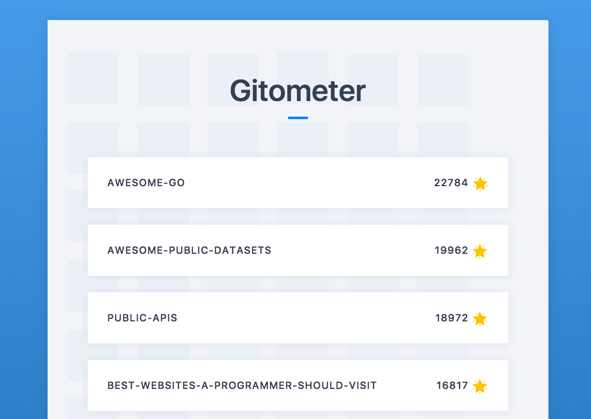
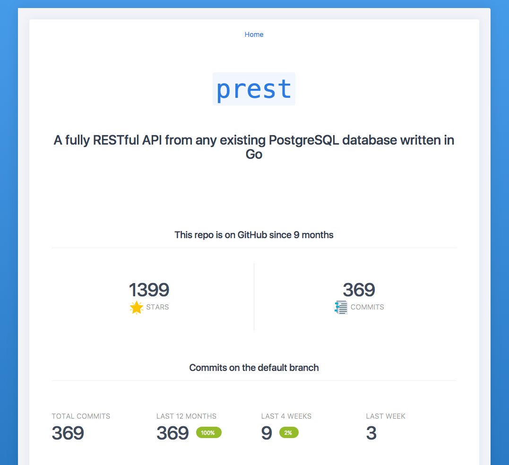
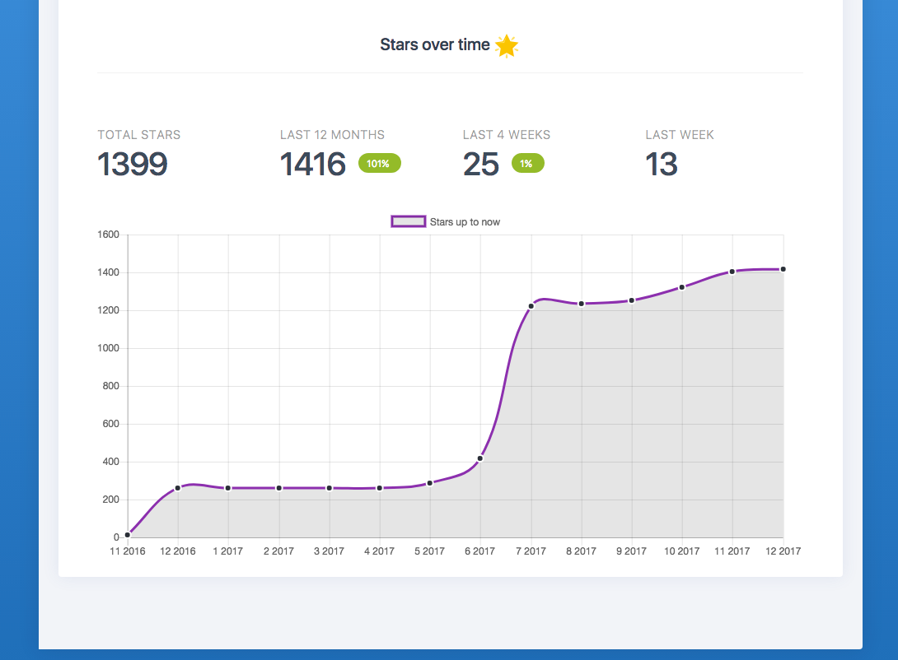

# Gitometer

## What it does

Shows data from GitHub repositories, stored locally in a Postgresql database

## How to run

Needs a DB with the schema provided in db.sql

Then needs the following environment vars set:

- `DBHOST`, e.g. `localhost`
- `DBPORT`, e.g 5432
- `DBUSER`, the pgsql username
- `DBPASS`, if empty use `""`
- `DBNAME`, the db name
- `GITOMETER_GITHUB_ACCESS_TOKEN`: a GitHub personal access token

Run

- `go get github.com/flaviocopes/gitometer...`
- `go get github.com/google/go-github/github`
- `go get github.com/jinzhu/now`
- `go get golang.org/x/oauth2`
- `go get github.com/lib/pq`

Then from `client/` run `yarn` and then `yarn start` (it's a `create-react-app` app)

From `server/` run [`watcher`](https://flaviocopes.com/golang-watch-changes-recompile/) or run the Go backend in any other way you prefer.

By default it runs the client on port `3000`, and the server on port `8000`.